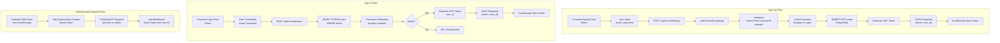

# Authentication Data Flow

Mermaid source for [dataflow-authentication.svg](dataflow-authentication.svg).

```mermaid
flowchart TB
  subgraph signup["Sign Up Flow"]
    s1["Frontend Signup Form\nReact"] --> s2["User Input\nemail / password"]
    s2 --> s3["POST /api/v1/auth/signup"]
    s3 --> s4["authController.signup()"]
    s4 --> s5["Validation\nemail format / password strength"]
    s5 --> s6["Hash Password\nbcryptjs or crypto"]
    s6 --> s7["INSERT INTO users\nPostgreSQL"]
    s7 --> s8["Generate JWT Token"]
    s8 --> s9["JSON Response\n{token, user_id}"]
    s9 --> s10["localStorage Store Token"]
  end

  subgraph signin["Sign In Flow"]
    i1["Frontend Login Form\nReact"] --> i2["User Credentials\nemail / password"]
    i2 --> i3["POST /api/v1/auth/signin"]
    i3 --> i4["SELECT FROM users\nWHERE email"]
    i4 --> i5["Password Verification\nbcryptjs.compare"]
    i5 --> i6{"Match?"}
    i6 -->|Yes| i7["Generate JWT Token\nuser_id"]
    i6 -->|No| i8["401 Unauthorized"]
    i7 --> i9["JSON Response\n{token, user_id}"]
    i9 --> i10["localStorage Store Token"]
  end

  subgraph authreq["Authenticated Request Flow"]
    a1["Frontend With Token\nfrom localStorage"] --> a2["Add Authorization Header\nBearer token"]
    a2 --> a3["Protected API Request\n/phones or similar"]
    a3 --> a4["authMiddleware\nVerify Token and User ID"]
  end
```
