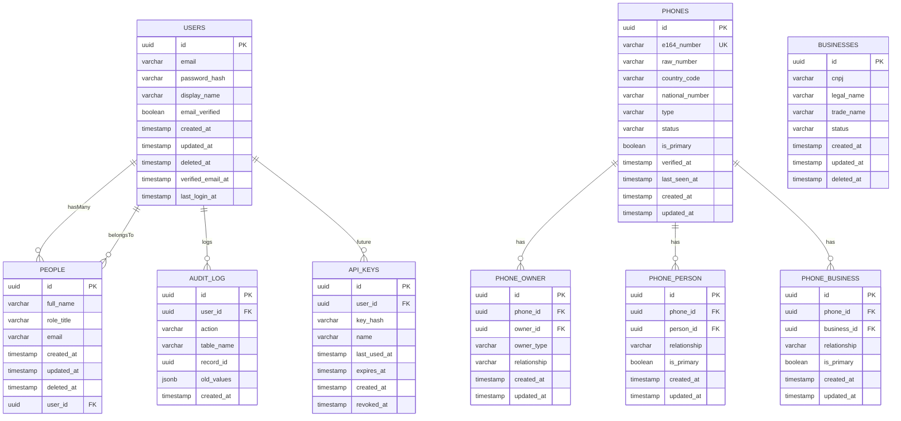

# Database Schema & Data Relationships

Mermaid source for [dataflow-database-schema.svg](dataflow-database-schema.svg).

```mermaid
erDiagram
  USERS ||--o{ PEOPLE : hasMany
  PHONES ||--o{ PHONE_OWNER : has
  PHONES ||--o{ PHONE_PERSON : has
  PHONES ||--o{ PHONE_BUSINESS : has
  USERS ||--o{ AUDIT_LOG : logs
  USERS ||--o{ API_KEYS : future
  PEOPLE }o--|| USERS : belongsTo

  USERS {
    uuid id PK
    varchar email
    varchar password_hash
    varchar display_name
    boolean email_verified
    timestamp created_at
    timestamp updated_at
    timestamp deleted_at
    timestamp verified_email_at
    timestamp last_login_at
  }

  PHONES {
    uuid id PK
    varchar e164_number UK
    varchar raw_number
    varchar country_code
    varchar national_number
    varchar type
    varchar status
    boolean is_primary
    timestamp verified_at
    timestamp last_seen_at
    timestamp created_at
    timestamp updated_at
  }

  PEOPLE {
    uuid id PK
    varchar full_name
    varchar role_title
    varchar email
    timestamp created_at
    timestamp updated_at
    timestamp deleted_at
    uuid user_id FK
  }

  BUSINESSES {
    uuid id PK
    varchar cnpj
    varchar legal_name
    varchar trade_name
    varchar status
    timestamp created_at
    timestamp updated_at
    timestamp deleted_at
  }

  PHONE_OWNER {
    uuid id PK
    uuid phone_id FK
    uuid owner_id FK
    varchar owner_type
    varchar relationship
    timestamp created_at
    timestamp updated_at
  }

  PHONE_PERSON {
    uuid id PK
    uuid phone_id FK
    uuid person_id FK
    varchar relationship
    boolean is_primary
    timestamp created_at
    timestamp updated_at
  }

  PHONE_BUSINESS {
    uuid id PK
    uuid phone_id FK
    uuid business_id FK
    varchar relationship
    boolean is_primary
    timestamp created_at
    timestamp updated_at
  }

  AUDIT_LOG {
    uuid id PK
    uuid user_id FK
    varchar action
    varchar table_name
    uuid record_id
    jsonb old_values
    timestamp created_at
  }

  API_KEYS {
    uuid id PK
    uuid user_id FK
    varchar key_hash
    varchar name
    timestamp last_used_at
    timestamp expires_at
    timestamp created_at
    timestamp revoked_at
  }
```
