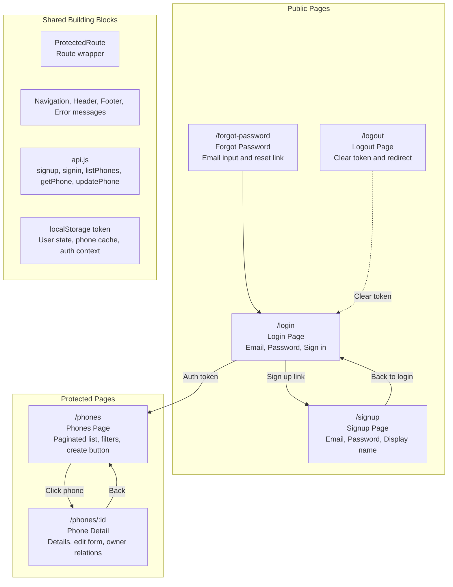

# Frontend Pages Map and Navigation

Mermaid source for [pages-frontend-map.svg](pages-frontend-map.svg).

```mermaid
flowchart TB
  subgraph public["Public Pages"]
    login["/login\nLogin Page\nEmail, Password, Sign in"]
    signup["/signup\nSignup Page\nEmail, Password, Display name"]
    forgot["/forgot-password\nForgot Password\nEmail input and reset link"]
    logout["/logout\nLogout Page\nClear token and redirect"]
  end

  subgraph protected["Protected Pages"]
    phones["/phones\nPhones Page\nPaginated list, filters, create button"]
    phone["/phones/:id\nPhone Detail\nDetails, edit form, owner relations"]
  end

  subgraph shared["Shared Building Blocks"]
    route["ProtectedRoute\nRoute wrapper"]
    ui["Navigation, Header, Footer, Error messages"]
    api["api.js\nsignup, signin, listPhones, getPhone, updatePhone"]
    state["localStorage token\nUser state, phone cache, auth context"]
  end

  login -->|Sign up link| signup
  signup -->|Back to login| login
  forgot --> login
  login -->|Auth token| phones
  phones -->|Click phone| phone
  phone -->|Back| phones
  logout -.->|Clear token| login
```
